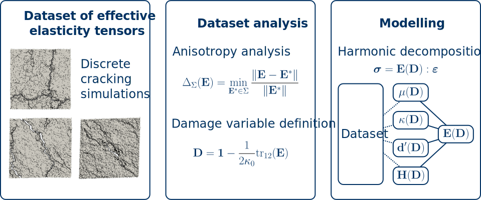

## Parcours

:::: {.columns}
::: {.column width="13%"}
2011--2014
:::

::: {.column width="87%"}
**BAC Technologique STI2D** 
:::
::::

:::: {.columns}
::: {.column width="13%"}
2014--2016
:::

::: {.column width="87%"}
**CPGE Techniques et Sciences Industrielles**
:::
::::

:::: {.columns}
::: {.column width="13%"}

2016--2020

:::

::: {.column width="87%"}

**ENS Paris-Saclay**

:::{.muted}
- L3 pluridisciplinaire (GM, GC, GE)
- M1 Mécanique des Matériaux et des Structures
- M2 Formation à l'Enseignement Supérieure en Mécanique
- M2 Mécanique des mAtériaux pour l'inGénierie et l'Intégrité des Structures
:::
:::
::::

. . .

:::: {.columns}
::: {.column width="13%"}
2020--2023
:::

::: {.column width="87%"}
**Thèse au Laboratoire de Mécanique Paris-Saclay**

:::{.muted}
Encadrée par Rodrigue Desmorat et Cécile Oliver-Leblond
:::

:::
::::

:::: {.columns}
::: {.column width="13%"}
2024--...
:::

::: {.column width="87%"}
**Post-doctorat à l'IMSIA** (ENSTA)

:::{.muted}
Encadré par Véronique Lazarus
:::
:::
::::

:::{.notes}
- Arrivée dans le supérieur STI2D, puis TSI (je vais ré-évoquer ce point plus tard).
- Intégré ENS Paris-Saclay, suivi L3 pluri, puis spécialisation en méca.
- Suivi le M2 FESup
- Durant ces années, stages portant sur la simulation numérique et la dégradation mécaniques des structures. Je ne reviens pas dessus.
- Puis thèse et post-doctorat
:::

## Thèse au LMPS

:::: {.columns}

::: {.column width="25%"}
**2020--2023**

{width="100%" fig-align="left"}
:::

::: {.column width="75%"}
**Formulation de l'endommagement anisotrope des matériaux et stuctures quasi-fragiles basée sur la simulation discrète de la fissuration**

R. Desmorat, C. Oliver-Leblond  
[*2 articles, 2 conférences internationales, 1 conférence nationale, 2 GdR.*]{.muted}
:::
::::
{fig-align="center"}

:::{.footer}
Dataset publié en *open access* sur RechercheDataGouv.
:::

:::{.notes}
- Endommagement anisotrope des matériaux quasi-fragiles (hétérogènes)
- Basé sur simulation discrète (voir figure) représentant explicitement la micro-fissuration
- Idée : mesurer l'évolution du tenseur d'élasticité d'un VER sous différents chargements
- Ensuite, analyse via outils mathématiques (distance aux classes de symétrie)
- Ensuite, définition d'une variable d'endo puis formulation de la loi d'état : tenseur d'élasticité en fonction de l'endo via la décomposition harmonique.
- Cas de l'évolution : traité mais pasz abouti.
:::

## Postdoctoral research at IMSIA (1/2)

:::: {.columns}
::: {.column width="25%"}
**2024--Now**

{width="70%" fig-align="left"}
:::

:::{.column width="75%"}
**Theoretical and numerical study of crack propagation   in heterogenous and/or anisotropic materials**

V. Lazarus  
[*2(+3) articles, ?(+2) international conferences, ?(+?) national conferences.*]{.muted}
:::
::::

::::{.columns}
:::{.column width=60%}

[** Open-source codes for crack propagation in 2D **]{.alert .r-stack .large}

[[ **floiseau/gcrack**]{.example}](https://github.com/floiseau/gcrack) [(linear elastic fracture mechanics)]{.muted}

[[ **floiseau/fragma**]{.example}](https://github.com/floiseau/fragma) [(phase-field)]{.muted}

::::::{.columns}
:::::{.column width=30%}
**Main features**
:::::

:::::{.column width=70%}

- Load control [(path-following)]{.muted}
- Fracture anisotropy
- Fatigue [(gcrack)]{.muted}
- Heterogeneities [(fragma)]{.muted}

:::::
::::::

:::

:::{.column width=40%}

{width=100%}

:::

::::

## Postdoctoral research at IMSIA (2/2)

Illustré avec un arbre partant des deux codes (mettre résultats/figures) et allant vers les études réalisés (mettre illustrations des contributions + collaborations ?)

::::{.columns}
:::{.column width=33%}
#### Theoretical/Numerical contributions

- LEFM crack propagation criterion and numerical solution
- Comparison LEFM vs PF for anisotropic fracture
- Load control (path-following)
- Bias in phase-field fracture simulations
  - initial cracks
  - mesh-induced bias (E. Zembra, H. Henry, PMC)

:::

:::{.column width=33%}
#### Collaborations 

- Polycarbonate imprimé 3D
  - Avec X. Zhai (IMSIA)

- PMMA (CCT)
  - Essais de D. Roucou (IMSIA)
  - Encadrement d'un stage

- Duplex imprimé 3D vieilli
  - Essais de D. Roucou (IMSIA)
  - Encadrement d'un stage

:::

:::{.column width=33%}

- Zones architecturés
  - J. Triclot (LMA)

- Fracture in rotating structures
  - Gilad + Pedro (EPFL)

- Recent works

:::

::::

#### Other works

- Régressions sparses
- Illustration of the procedure with an example:
    1. Problem
    2. Analysis (dimensionless function we want to determine)
    3. Data collection (numerical)
    4. Sparse regression results: analytical approximation.

## [Responsabilités]{.example} en recherche

Stage

Animation scientifique

Autres

- Création et gestion de code collaboratifs
- Intérêt pour la science ouverte

## Projet d'intégration en recherche

[*Équipe Multimap du LaMCoS*]{.muted}
 

#### [Objectif]{.example}

:::{.example}
Objectif dans le **dossier**
:::

:::{.absolute top="0%" right="0%"}
{width=280}
:::

**TODO** Schéma récapitulatif des thématiques de recherche envisagés (freeplane ou inkscape)

## Bases théoriques et numériques

S'appuyer sur la 3rd body method pour avoir un cadre permettant de facilement intégrer des comportement complexes pour les solides en contact.

## Modélisation

Comportement du troisième corps

- Contact sans frottement
- Frottement (comportement anisotrope)
- Vers l'usure ??

Comportement des matériaux en contacts

- Ce qu'on veut (plasticité, comportements multi-physiques, etc.)
- Mon expertise : fracture et endommagement

## Vers des applications industrielles

Le but final sera d'aller vers des applications industrielles ....

Possiblité de collaborations avec des industriels + Intervention dans le projet ANR

*Cette slide correspond peut-être plutôt au besoin.*

## Activités d'enseignement

:::: {.columns}
::: {.column width="13%"}
Avant 2020
:::

::: {.column width="87%"}
[**Divers**]{.smallcaps .example}

:::{.muted}
Aide aux devoirs (pour lycéens)  
Interventions l'IUT de Cachan (M2E FESup)
:::

:::
::::

:::: {.columns}
::: {.column width="13%"}
2020--2023
:::

::: {.column width="87%"}
[**Mission d'enseignement**]{.smallcaps .example} &emsp; ENS Paris-Saclay - L3 et M1 en Génie Civil

:::{.muted}
Méthodes Numériques, Mécanique des Fluides, Propagation d'ondes, Matlab.
 
:::

:::
::::

:::: {.columns}
::: {.column width="13%"}
2024
:::

::: {.column width="87%"}
[**Vacations**]{.smallcaps .example} &emsp;&emsp;&emsp;&emsp;&emsp;&emsp;&emsp; ENSTA - 1A et 2A Mécanique

:::{.muted}
MMC solide élastique, Comportements non-linéaires, Fatigue, Rupture, Projet Matlab.
 
:::

:::
::::

 

#### Évolution des formations

- Sujet de TD de Méthodes Numériques
<!-- - Automatisation de la répartition pour séance de soutien Matlab -->
- Supports TP et Examen de Mécanique de la rupture en FEniCSx

:::{.absolute bottom="0%" right="-35%"}
{width=33%}
:::

:::{.notes}
- Pour la plupart de ces modules, TD et/ou TP + corrections rapport/exam.
- Participations à des jurys de stages/projets
:::

## Adéquation au profil recherché

## Intégration dans les formations

## Mise en situation pédagogique

