## Parcours

:::: {.columns}
::: {.column width="13%"}
2011--2014
:::

::: {.column width="87%"}
**BAC Technologique STI2D**  [(spécialité ITEC)]{.muted}
:::
::::

:::: {.columns}
::: {.column width="13%"}
2014--2016
:::

::: {.column width="87%"}
**CPGE Techniques et Sciences Industrielles**
:::
::::

:::: {.columns}
::: {.column width="13%"}

2016--2020

:::

::: {.column width="87%"}

**ENS Paris-Saclay**

:::{.muted}
- L3 pluridisciplinaire (GM, GC, GE)
- M1 Mécanique des Matériaux et des Structures
- M2 Formation à l'Enseignement Supérieure en Mécanique
- M2 Mécanique des mAtériaux pour l'inGénierie et l'Intégrité des Structures
:::
:::
::::

. . .

:::: {.columns}
::: {.column width="13%"}
2020--2023
:::

::: {.column width="87%"}
**Thèse au Laboratoire de Mécanique Paris-Saclay**

:::{.muted}
Encadrée par Rodrigue Desmorat et Cécile Oliver-Leblond
:::

:::
::::

:::: {.columns}
::: {.column width="13%"}
2024--...
:::

::: {.column width="87%"}
**Post-doctorat à l'IMSIA** (ENSTA)

:::{.muted}
Encadré par Véronique Lazarus
:::
:::
::::

:::{.notes}
- Arrivée dans le supérieur STI2D, puis TSI (je vais ré-évoquer ce point plus tard).
- Intégré ENS Paris-Saclay, suivi L3 pluri, puis spécialisation en méca.
- Suivi le M2 FESup
- Durant ces années, stages portant sur la simulation numérique et la dégradation mécaniques des structures. Je ne reviens pas dessus.
- Puis thèse et post-doctorat
:::

# Enseignement

:::{.large}
1 &emsp; Expériences en enseignement  
2 &emsp; Projet d'intégration  
3 &emsp; Mise en situtation
:::

## NOTES

Il faut peut-être découper la slide suivante par activités et illustrer les TPs/TD

## Activités d'enseignement

:::: {.columns}
::: {.column width="13%"}
Avant 2020
:::

::: {.column width="87%"}
[**Divers**]{.smallcaps .example}

:::{.muted}
Aide aux devoirs (niveau lycée)  
Préparation aux examens et TP à l'IUT de Cachan (GMP)
:::

:::
::::

:::: {.columns}
::: {.column width="13%"}
2020--2023
:::

::: {.column width="87%"}
[**Mission d'enseignement**]{.smallcaps .example}
&emsp;
 ENS Paris-Saclay
&emsp;
 Génie Civil (L3, M1)
&nbsp;&nbsp;&nbsp;&nbsp;
 64h $\times$ 3 ans

:::{.muted}
Méthodes Numériques, Propagation d'ondes, Mécanique des Fluides, Matlab
 
:::

:::
::::

:::: {.columns}
::: {.column width="13%"}
2024--2026
:::

::: {.column width="87%"}
[**Vacations**]{.smallcaps .example}
&emsp;&emsp;&emsp;&emsp;&emsp;&emsp;&emsp;
 ENSTA
&emsp;&emsp;&emsp;&emsp;&emsp;&nbsp;&nbsp;
 Mécanique (1A, 2A)
&ensp;&nbsp;
 42h + 51h

:::{.muted}
MMC solide élastique, Comportements non-linéaires, Fatigue, Rupture, Projet Matlab
 
:::

:::
::::

 

####  Évolution des formations

- Sujet de TD de Méthodes Numériques
<!-- - Automatisation de la répartition pour séance de soutien Matlab -->
- Supports numériques de TP en Mécanique de la rupture
  - [Code Python utilisant FEniCSx + Docker (pérénisation)]{.muted}

:::{.absolute bottom="0%" right="-35%"}
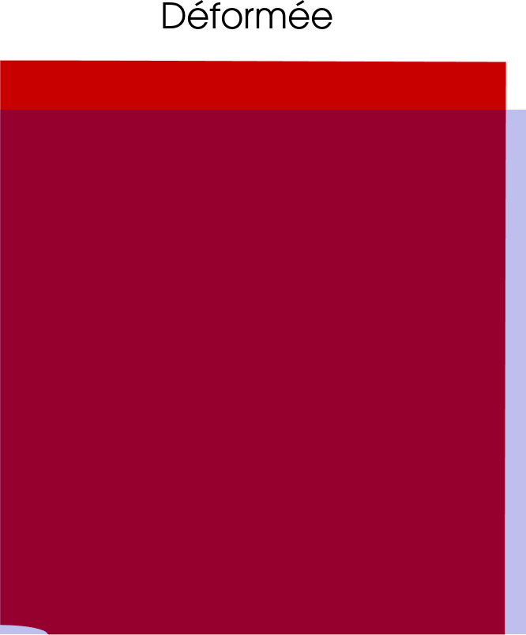{width=33%}
:::

:::{.notes}
- Pour la plupart de ces modules, TD et/ou TP + corrections rapport/exam.
- Participations à des jurys de stages/projets
:::

## Intégration dans les formations

::::{.columns}
:::{.column width=70%}
Intégration dans les formations de [**conception mécanique et procédés**]{.example} assurée ma [**formation**]{.example}.

[Moins pratiqué récemment MAIS longue formation depuis la STI2D]{.alert}

[Suivi des TD/TP des autres membres de l'équipe pédagogique + formations spécifiques procédés]{.alert}

[Former à la CAO (SolidWorks et CATIA) $\rightarrow$ adaptation à SolidEdge et 3DEXPERIENCE]{.alert}
:::
:::{.column width=30%}
{width=100%}
:::
::::

####  Formation Initiale aux Métiers d'Ingénieur (FIMI)

| Année  | Cours                                                 | Intégration             |
|--------|-------------------------------------------------------|-------------------------|
| FIMI 1 | Conception mécanique 1/2                              | Formation + Recherche   |
|        | MF10(1/2) - Mécanique des fluides incompressibles 1/2 | Formation + Exp. ENS PS |
| 2ème   | *MS201 - Comportement non-linéaire des matériaux*     | *Exp. ENSTA*            |
|        | MS202 - Modélisation des structures élancées          | Formation               |

: {tbl-colwidths="[8, 60, 32]"}

####  Formation Ingénieur - Département Génie Mécanique (GM)

**TODO: table with the blablabla**

## Évolution & Innovation pédagogique

 

::::{.columns}
:::{.column}

####   Maîtrise d'outils numériques variés

[Programmation, calcul scientifique, supports.]{.muted}

#### 📚 Autres intérêt pédagogiques

- Pédagogie inductive  
  &emsp; [*Activités de mise en situation*]{.muted}  
  &emsp; [*Projet*]{.muted}
- Intégration enjeux sociétaux  
  &emsp; [*Aspects environnementaux*]{.muted}  
  &emsp; [*Intelligence artificielle*]{.muted}
- Enseignements digitaux  
  &emsp; [*Supports interactifs, vidéos*]{.muted}  
  &emsp; [*Accessibilité (e.g., via Quarto)*]{.muted}  
- À terme, responsabilités pédagogiques

 

:::

:::{.column}

#### TODO

:::
::::

## Mise en situation pédagogique
::::{.columns .large .alert}
:::{.column width=20%}
 Licence 2  
 &nbsp;8 heures
:::

:::{.column width=80%}
Comment **concevoir et réaliser une liaison encastrement démontable**   entre l’écran et le boîtier d’un smartphone ?
:::

::::

#### Compétences visées

<!-- À l'issue de la formation, les étudiants seront capables de: -->
À partir d'un système mécanique initiale et d'un cahier des charges,

- Identifier et proposer des solutions technologiques pour la conception d'une liaison encastrement
- Réaliser une conception détaillée de la solution retenue (maquette numérique, cotation, dimensionnement, etc.)
- Choisir et mettre en œuvre un procédé de fabrication adapté (fraisage, tournage, découpe laser)

::::{.columns}

:::{.column}
#### Contenus mobilisés

- Conception mécanique 1 (FIMI, S1)
  - [lecture dossier technique, identification des surfaces fonctionnelles, dessin et CAO]{.muted}
- Conception mécanique 2 (FIMI, S2)
  - [graphe de liaison, cotation, technologie et conception d'une liaison encastrement, CAO, mise en plan.]{.muted}
:::

:::{.column}
#### Connaissances visées (TODO ???)

- Fonction d'une liaison encastrement
- Familles de solutions technologiques   en fonction des contraintes et des surfaces fonctionnelles
- Critères de choix

####  Organisation

- Démarche pédagogique retenue (inductive, déductive, par technologie)
:::

::::

##  Organisation 

1. Introduction
    - Introduction au projet
        - Intérêt d'un encastrement démontable
        - Présentation du support d'étude (initial : collé)
        - Présentation du (nouveau) cahier des charges
    - Rappel ???
2. Projet
    - Lecture du dossier : familiarisation avec la solution technologique existante, analyses de nouvelles contraintes fonctionnelles
    - Identification des surfaces fonctionnelles
    - Choix d'une solution technologiques
        - [Classique : MIP contour écran "conique" + MAP colle + étanchéité](https://www.youtube.com/watch?v=LMeI5F1hb_A)
        - [FairPhone : MIP contour écran "conique" + MAP vis + Pas de joint ?](https://www.youtube.com/watch?v=Vk3_dUIwk7k)
        - [Projet ara de Google](https://www.01net.com/actualites/projet-ara-le-projet-fou-de-smartphone-modulaire-de-google-revient-hanter-le-web.html)
        - Écrans tactiles en général : https://www.phoenix-mecano.ch/fr/solutions/technique-de-boitiers/hmi-solutions/integration-ecran-tactile/
    - Dessin de la solution -> cotation
    - CAO : opérations booléennes + assemblage + tolérancement + mise en plan
    - Réalisation sur les machines : découpage ??, perçage + taraudage 
    - Montage + Notice de montage ???

## Séance introductive (≈ 1h)

#### Objectifs

- Connaître les fonctions d’une liaison encastrement.
- Connaître les solutions technologiques et les choisir en fonction des contraintes fonctionnelles.

#### Déroulement

::::{.columns}
:::{.column}
1. **Introduction (5 min)** :
    - Objectif : Supprimer les mobilités d'un ensemble cinématique par rapport à un autre.
    - Pourquoi :
        - [Maintenance, réparation, recyclage, etc.]{.muted}
<!--    - Fil rouge : "Comment rendre un smartphone plus réparable ?" (parler de la batterie) -->
2. **Fonctions et contraintes (20 min)** :
    - Fonction de la liaison encastrement démontable
        - [MIP/MAP, transmission de puissance, étanchéité, fiabilité.]{.muted}
    - Torseurs statiques et cinématiques.
:::
:::{.column}
3. **Solutions technologiques (25 min)** :
    - Méthodologie de conception
        - Fiche synthétique avec critères de choix, avantages/inconvénients, exemples.
    - Étude de cas : TODO analyse d’un smartphone existant (vidéo/images).
4. **Conclusion (5 min)** :
    - Synthèse
    - Présentation du projet
:::
::::

:::{.footer}
Ressources réparabilité : [EU Directive on repair of goods](https://commission.europa.eu/law/law-topic/consumer-protection-law/directive-repair-goods_en), [Right to Repair](https://repair.eu/).
:::

## Projet (7h, binômes)

**Objectifs**

- Appliquer la démarche de conception à un cas concret.
- Travailler en équipe et justifier ses choix.

**Données**  
Cahier des charges, plan (écran, boitier et "autres pièces pour l'encombrement"), sujet guidé avec les grandes étapes.

[https://www.printables.com/model/1358929-fairphone-6-case-base](https://www.printables.com/model/1358929-fairphone-6-case-base)
[https://forum.fairphone.com/t/design-files-for-fairphone-2-cover-released/35713](https://forum.fairphone.com/t/design-files-for-fairphone-2-cover-released/35713)

**Déroulement** :

1. **Analyse du problème (1h)** :
    - Lecture du cahier des charges
    - Lecture des plans initiaux : Identification des surfaces fonctionnelles/intouchables.
        - Bilan à la fin de cette étape
2. **Choix de la MIP/MAP (1.5h)** :
    - Graphe de liaison + justification.
3. **Solutions techniques (2h)** :
    - Brainstorming + choix de la solution.
    - Croquis à la main des solutions envisagées.
4. **Mise en plan (1.5h)** :
    - Croquis coté final ou CAO (si possible, opérations booléennes).
5. **Notice de montage/démontage (1h)** :
    - Rédaction selon un format standardisé ?
6. **Synthèse (1h)** :
    - Présentation rapide des solutions par chaque binôme + feedbacks.
    - Auto-évaluation guidée entre étudiants ??? + Évaluation par le prof ?

## Supports d'études

Illustration de solution techniques

# Recherche

:::{.large}
1 &emsp; Expériences en recherche  
2 &emsp; Projet d'intégration
:::

## Thèse au LMPS

:::: {.columns}

::: {.column width="25%"}
**2020--2023**

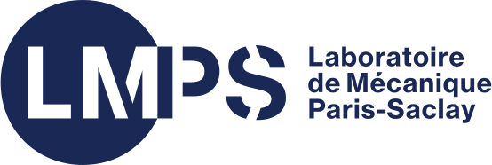{width="20%" .absolute top=18%}
:::

::: {.column width="75%"}
**Formulation de l'endommagement anisotrope des matériaux et stuctures quasi-fragiles basée sur la simulation discrète de la fissuration**  
R. Desmorat, C. Oliver-Leblond  
[*2 articles, 2 conférences internationales, 1 conférence nationale, 2 GdR.*]{.muted}
:::
::::

[ Model damage in micro-cracking material $\boldsymbol{\sigma} = \tilde{\mathbf{E}}(\mathbf{D}) : \boldsymbol{\varepsilon}$ from discrete simulations]{.alert .large}

::::{.columns}

:::{.column width=33%}
#### 1. Discrete simulations

::: {layout-ncol=2}

 
21 loads  
36 $\mu$-structures
$\to$ 76k steps

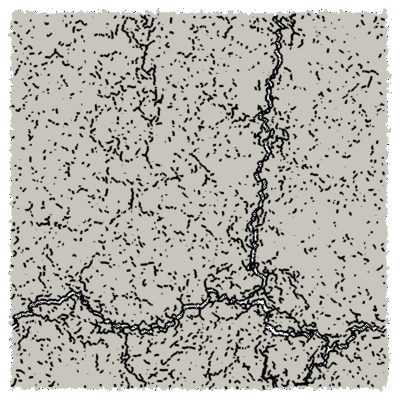{width=4cm}

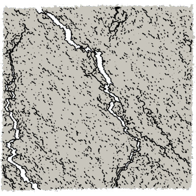{width=4cm}

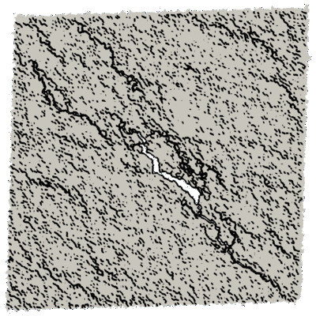{width=4cm}

:::

:::

:::{.column width=33%}
#### 2. Effective elasticity tensors

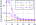{width=100%}

 Analysis of symmetry classes

:::

:::{.column width=33%}

#### 3. Modelling

a. Damage definition
  $$\mathbf{D} = \mathbf{1} - \frac{1}{\kappa_0} \mathrm{tr}_{12} (\mathbf{E})$$

b. Harmonic decomposition

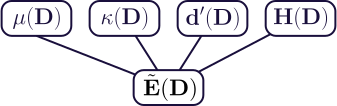{width=100%}

:::
::::

:::{.footer}
 @loiseau_anisotropic_2023 and @vedrine_calibration_2025 &emsp;  Dataset: [https://doi.org/10.57745/LYHM4W](https://doi.org/10.57745/LYHM4W)
:::

:::{.notes}
- Endommagement anisotrope des matériaux quasi-fragiles (hétérogènes)
- Basé sur simulation discrète (voir figure) représentant explicitement la micro-fissuration
- Idée : mesurer l'évolution du tenseur d'élasticité d'un VER sous différents chargements
- Ensuite, analyse via outils mathématiques (distance aux classes de symétrie)
- Ensuite, définition d'une variable d'endo puis formulation de la loi d'état : tenseur d'élasticité en fonction de l'endo via la décomposition harmonique.
- Cas de l'évolution : traité mais pasz abouti.
:::

## Postdoc at IMSIA - Overview

:::: {.columns}
::: {.column width="25%"}
**2024--Now**

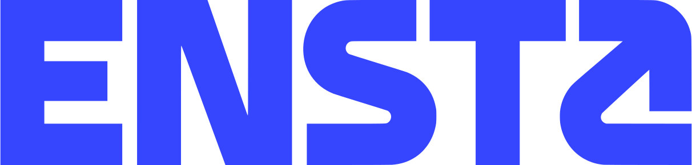{width="70%" fig-align="left"}
:::

:::{.column width="75%"}
**Theoretical and numerical study of crack propagation   in heterogenous and/or anisotropic materials**  
V. Lazarus  
[*2(+3) articles, ?(+2) international conferences, ?(+?) national conferences.*]{.muted}
:::
::::

[** Open-source codes for 2D crack propagation**]{.alert .large}

::::{.columns}
:::{.column width=40%}

 

[[ **floiseau/gcrack**]{.example}](https://github.com/floiseau/gcrack) [(LEFM^[LEFM = Linear Elastic Fracture Mechanics])]{.muted}

[[ **floiseau/fragma**]{.example}](https://github.com/floiseau/fragma) [(phase-field)]{.muted}

**Main features**

::::::{.columns}
:::::{.column width=50%}
- Load control   [(path-following)]{.muted}
- Fracture anisotropy
:::::

:::::{.column width=50%}

- Heterogeneities [(fragma)]{.muted}
- Fatigue [(gcrack)]{.muted}

:::::
::::::

:::

:::{.column width=60%}

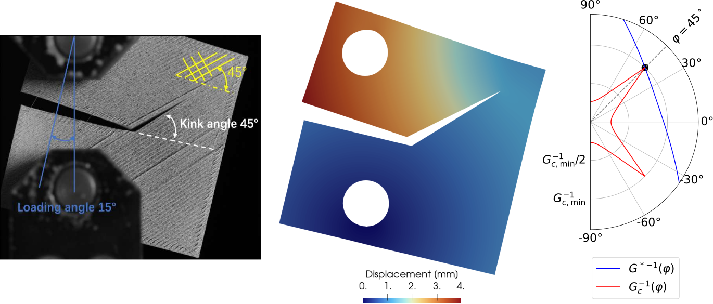{width=100%}

:::
::::

## Postdoc at IMSIA - Numerical aspects

[ Develop robust numerical tools for crack propagation in anisotropic materials]{.alert .large}

::::{.columns}

:::{.column width=33%}

#### Load control 

&emsp;&nbsp;Force load + Fracture = Instable

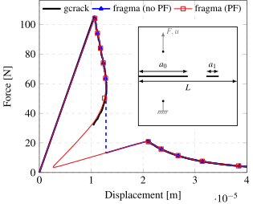{width=100%}

 @loiseau_path-following_2026

:::{.muted}
- Novel path-following method
- Comparison phase-field vs LEFM
:::
:::

:::{.column width=66%}

#### Limiting numerical bias in phase-field simulations of fracture

::::::{.columns}
:::::{.column width=38%}
**Initial cracks**

 @loiseau_how_2025

:::{.muted}
- Unbiased initial crack   in phase-field fracture
:::

:::::

:::::{.column width=61%}
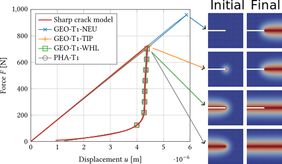{width=100%}
:::::
::::::

::::::{.columns}
:::::{.column width=38%}
**Mesh-induced bias**

[ E. Zembra \& H. Henry (PMC)]{.verysmaller .muted}

:::{.muted}
- Quantify mesh bias in crack path prediction
:::
:::::

:::::{.column width=61%}
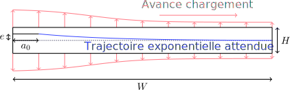{width=100%}
:::::
::::::

:::

::::

## Postdoc at IMSIA - Applications

[ Simulate crack propagation for real problem]{.alert .large}

#### External collaborations 

::::{.columns}

:::{.column width=50%}

::::::{.columns}

:::::{.column width=57%}
**Fracture in rotating structures**  
[ G. Yakir \& P. Reis (EPFL)]{.verysmaller .muted}

:::{.muted .verysmaller}
- Determination of the crack propagation threshold
:::
:::::

:::::{.column width=43%}
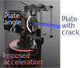{width=100%}
:::::
::::::

:::

:::{.column width=50%}

::::::{.columns}
:::::{.column width=55%}
**Optimization of dissipation during crack propagation**  
[ J. Triclot (LMA)]{.verysmaller .muted}

:::::

:::::{.column width=43%}
:::{.muted .verysmaller}
- Simulation of crack propagation   with load control
:::
:::::
::::::

{width=75% fig-align=center}

:::

::::

::::{.columns}
:::{.column width=50%}
**Sparse analytical regressions** 
[ Discussions for applications at Safran Aircraft Engines]{.verysmaller .muted}

::::::{.columns}
:::::{.column width=49%}
TODO

:::::

:::::{.column width=49%}
illustration
:::::
::::::

<!--
1. Problem
2. Analysis (dimensionless function we want to determine)
3. Data collection (numerical)
4. Sparse regression results: analytical approximation.
-->

:::

:::{.column width=50%}

#### And numerous collaborations at IMSIA

::::::{.columns}

:::::{.column width=30%}
**Fracture in   3D-printed structures** 
:::::

:::::{.column width=68%}
:::{.muted .verysmaller}
Polycarbonate (X. Zhai)  
Duplex steel (D. Roucou \&  N. Habib)  
Repaired steel structures (L. Kiakouama)
:::
:::::

::::::

::::::{.columns}

:::::{.column width=30%}
**Others** 
:::::

:::::{.column width=68%}
:::{.muted .verysmaller}
Mixed mode fracture in PMMA (D. Roucou)  
Specimen design (K. Paquet)
:::
:::::

::::::

:::
::::

## Encadrements

::::{.columns}

:::{.column}

#### Effect of crack distribution on the elasticity tensor
[*2022 - A. Marlot - M1 ENS Paris-Saclay*]{.muted}

{fig-align=center width=100%}

#### Study of size effect in discrete simulation
[*2023 - L. Védrine - M2 ENS Paris-Saclay*]{.muted}

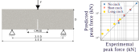{fig-align=center width=80%}
:::

:::{.column}

#### Phase-field simulations of anisotropic fracture
[*2024 - A. Ecotiere - 2A ENSTA*]{.muted}

TODO  
TODO  
TODO

#### Crack propagation in mixed mode I+II in CCT specimen
[*2025 - Y. M. V. Epongue Djeugoue - 2A ENSTA*]{.muted}
[*Experiments by D. Roucou at IMSIA.*]{.muted .verysmaller}

<!--
{autoplay=true loop=true width=47% .absolute top="36%" left="52%" .fragment .fade-out fragment-index=1}

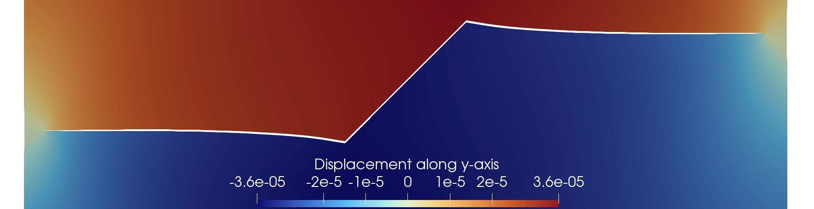{width=47% .absolute top="34.4%" left="52%" .fragment fragment-index=1}

 
 
 
 
 
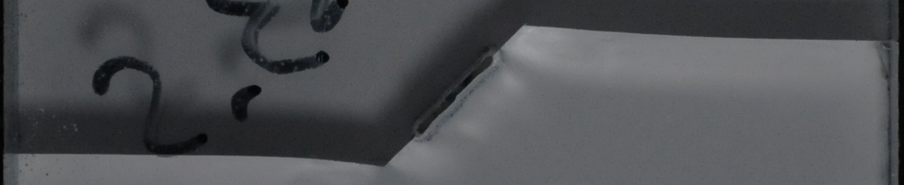{width=90% fig-align=center}
-->

{width=89% fig-align=center}

{fig-align=center autoplay=true loop=true width=100% .fragment fragment-index=1}

<!--
{fig-align=center width=100% .fragment fragment-index=1}
-->

:::

::::

<!--
Animation scientifique

Autres

- Création et gestion de code collaboratifs
- Intérêt pour la science ouverte
-->

## Intégration en recherche
[*Équipe Multimap du LaMCoS*]{.muted}

#### [ **Objectif global : Modéliser et simuler des solides en contact sous sollicitations extrêmes**]{.large .alert}

:::{.absolute top="0%" right="0%"}
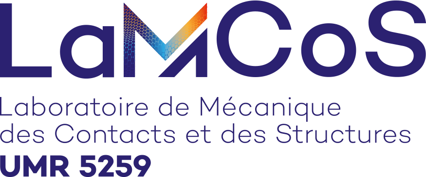{width=280}
:::

####  Intégration aux axes thématiques

- Comportement multiphysique des matériaux sous sollicitations extrêmes
  - Comportement sous sollicitations de contact
  - [Aspects numériques pour la dynamique]{.muted}
- [Procédés innovants de fabrication et de traitement de surface (métaux et polymères)]{.muted}

::::{.columns}
:::{.column width=70%}

#### Contributions visées

**Modélisation du comportement**

:::{.muted style="margin-left: 2em;"}
- Endommagement/Rutpure, Plasticité, Thermo-mécanique
- Anisotropie, Hétérogénéités
- Méthodes de modélisation [(approches *data-driven*, régressions sparses)]{.verysmaller}
:::

**Simulation numérique**

:::{.muted style="margin-left: 2em;"}
- Intégration de loi de comportement
:::

:::
:::{.column width=30%}

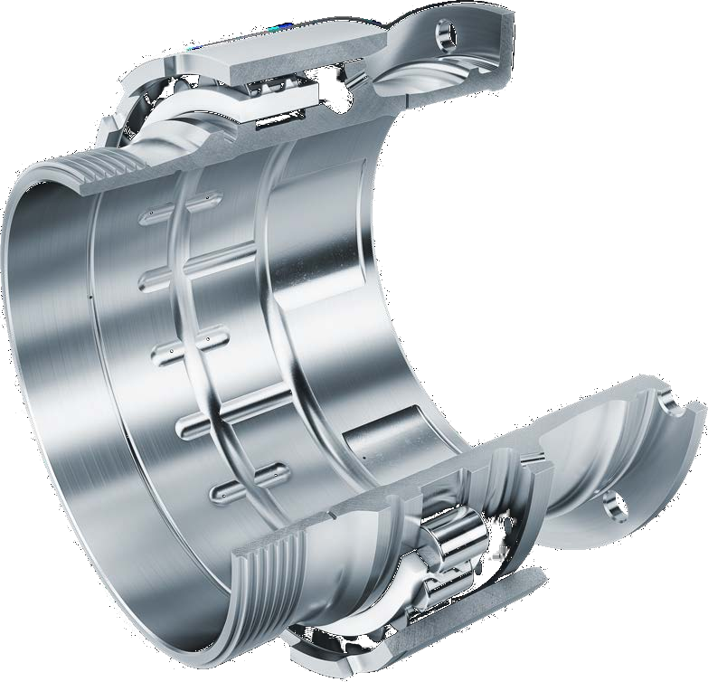{fig-align=center width=75%}

:::
::::

## Projet spécifique : Cadre de base

#### [ **Objectif du projet : Développer un cadre numérique combinant contact et modèles de comportement avancés**]{.alert}

####  Approche envisagée : Modélisation du contact via la méthode TMC [@wriggers_finite_2013]

::::{.columns}

:::{.column width=65%}

 **Principe**

3ème medium raidissant en compression entre les solides en contact

 Cadre variationnel, Implémentation simple
&emsp;  Contact approché

 **En pratique**

Minimisation de l'énergie potentielle **(+ plot of the law!)**
$$
\mathcal{P}(\boldsymbol{u}, ...) = \mathcal{P}_1(\boldsymbol{u}, ...) + \mathcal{P}_2(\boldsymbol{u}, ...) + \color{red}{\int_{\Omega_{\mathrm{TM}}} W_{\mathrm{TM}}(\boldsymbol{u}) \mathrm{d}\Omega},
$$
avec par exemple,
$$
W_{\mathrm{TM}}(\boldsymbol{u}) = \frac{\kappa}{2} \ln^2(J) + \frac{\mu}{2} (J^{-2/3} I_1 - 3),
$$
[où les invariants sont $J = \mathrm{det} (\mathbf{F})$ et $I_1 = \mathrm{tr} (C)$.]{.muted}

:::

:::{.column width=30%}
![Illustration de la méthode *Third Medium Contact*   [@wriggers_finite_2013].](figures/reseach_project_illustration_third_medium_contact.svg){width=60%}

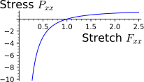{width=100%}
:::
::::

## Projet spécifique : Axes de recherche

 

::::{.columns}

:::{.column}

#### 1. Comportement du 3ème media

**a. Frottement**  
Couplage déformation volumique--cisaillement

$$
W_{\mathrm{TM}}(\boldsymbol{u}) = \frac{\kappa}{2} \ln^2(J) + \frac{\color{red}{\mu(I_1, I_2, J)}}{2} (J^{-2/3} I_1 - 3),
$$

 

**b. Usure**  
Remplacer le 3ème medium par une phase diffuse $\alpha$

$$
\mathcal{P}(\boldsymbol{u}, \alpha) = \color{red}{(1-\alpha)^2} \mathcal{P}_{1+2}(\boldsymbol{u}) + \color{red}{\alpha^2} \mathcal{P}_{\mathrm{TM}} + \color{red}{\mathcal{D}(\alpha)},
$$
où $\alpha=0 \rightarrow$ sain, $\alpha=1 \rightarrow$ usure, $\dot{\alpha} \geq 0$.

[ Dégradation de la modélisation du contact]{.muted}

:::

:::{.column}

#### 2. Comportements des solides en contact

**a. Méthode variationnelle incrémentale** 

Thermo-mécanique des MSG$^1$ [@yang_variational_2006]  
[$\rightarrow$ Plasticité, endommagement, etc.]{.muted}

**b. Développement de loi de comportement**

 

#### 3. Exemples d'application (aéronautique)

::::{.columns}
:::{.column width=49%}
{fig-align=center height=5cm}
:::

:::{.column width=49%}
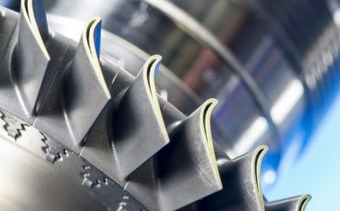{fig-align=center height=5cm}
:::
::::

:::

::::

:::{.footer}
1. MSG = Matériaux Standards Généralisés
:::

## Projet spécifique : En pratique {.scrollable}

::::{.columns}
:::{.column width=65%}

####  Implémentation numérique

**FEniCSx** avec solveurs non-linéaire (PETSc/TAO)  
[&emsp; $\rightarrow$ Si instabilités numériques : régularisation ou gradient de Sobolev.]{.muted}
:::

:::{.column width=35%}
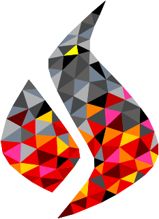{height=2.5cm}
&emsp;
{height=2.5cm}
:::
::::

::::{.columns}
:::{.column}

####  Démarche

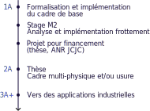{fig-align=center width=83%}

:::

:::{.column}

#### Moyens (TODO ???)

- Ressources et collab ????

#### Limites

Glissement/roulement $\implies$ Distorsion du maillage  
[&emsp; $\rightarrow$ $r$-adaptation du maillage ?]{.muted}

#### Intérêt

- Comportement : [Cadre numérique unifié]{.muted}
- Contact : [Multi-corps, frottement, usure]{.muted}

:::

::::

## Conclusion

Faire une slide de fin

## References

::: {#refs}
:::

